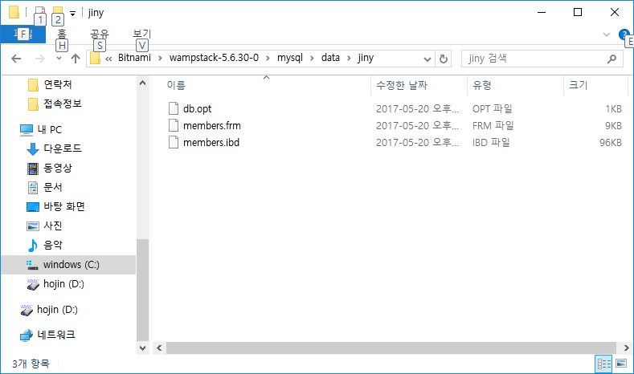
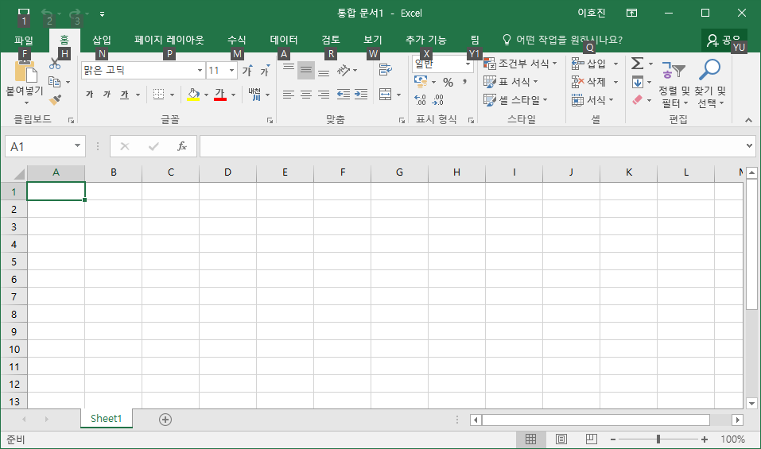

# 06.1.테이블 
보통 테이블은 초기 DB의 구조를 설계할 때 한 번 생성하는 경우가 많이 있습니다. 이런 경우 전용 GUI 기반의 DB 관리 툴을 이용하는 경우가 많습니다. DB 관리 툴로 오라클 에서 배포하는 Workbench, 웹 기반의 관리 툴인 phpmyadmin와 같은 다양한 무료 유 틸리티가 있습니다.  

또한 데이터베이스의 테이블은 SQL 명령을 통하여 생성할 수도 있습니다. 테이블을 생성 하는 SQL 명령문으로는 CREATE TABLE 을 사용하면 됩니다. 작성 쿼리 문법은 다음과 같습니다.  

| 쿼리 문법 | 
```sql
CREATE TABLE 테이블명 ( 
컬럼명 선언 ... 
컬럼명 데이터 타입 컬럼 속성, 
컬럼명 데이터 타입 컬럼 속성, 
컬럼명 데이터 타입 컬럼 속성 
); 
```

데이블 생성 명령과 테이블명, 소괄호 안에 포함될 컬럼의 정보들을 나열하면 됩니다. 다 수의 컬럼들은 콤마 (,) 기호로 구분되어 정의합니다. 위와 같은 형식으로 SQL 문법을 작 성하면 테이블을 생성합니다.  

테이블 생성 후에 실제적으로 MySQL 데이터가 저장되어 있는 경로를 확인해 보면 데이 터베이스명의 폴더 안에 생성한 테이블 파일들을 확인할 수 있습니다.  



위의 파일 구조는 데이터베이스명 및 테이블의 개념을 설명하기 위해서 화면을 캡처한 것 입니다. MySQL 및 SQL 명령으로 접근해야 합니다. 파일을 직접 조작해서는 안 됩니다.  

## 06.1.1 컬럼과 로우 
테이블은 실제적인 데이터를 셀 형태로 저장하고 보관합니다. 테이블은 컬럼이라는 기준 으로 각각의 데이터 형식을 구분하고, 컬럼에 맞는 데이터를 열 (rows)로 추가하여 데이터 를 가지고 있습니다.  

우리가 일반적으로 많이 사용하는 엑셀의 경우 다수의 사각 박스 형태의 그리드 모양을 볼 수 있습니다. 하나 하나의 박스가 그리드입니다. 여기에는 데이터 값을 입력할 수 있는 저장 영역입니다.  



위처럼 위의 A, B, C 형태로 이름이 있는 부분이 컬럼 영역이라고 생각하면 됩니다. 데이 터베이스에서는 컬럼명을 하나씩 지정해야 하지만 엑셀의 경우 미리 알파벳으로 지정해 놓고 있는 것입니다. 컬럼은 다른 말로 필드(field)라는 표현으로도 불립니다.  

다음 왼쪽에 숫자로 되어 있는 칸이 있는데 이를 열 (Rows)이라고 합니다. 각각의 컬럼에 맞게 데이터가 순차적으로 입력되는 영역입니다. 데이터가 컬럼 양식에 맞게 열이 추가되 면서 하나씩 증가됩니다. 열(Rows)은 다른 말로 레코드(Record)라고도 불립니다.  

테이블은 엑셀과 같이 컬럼과 열의 실제적인 데이터를 가지는 물리적 파일입니다.  

## 06.1.2 칼럼 이름 
테이블에는 최소 1개 이상의 컬럼을 선언해야 합니다. 컬럼명은 중복하여 저장할 수 없습 니다. 1개의 테이블 안에서의 컬럼은 유일한 이름을 갖게 됩니다. 중복하여 이름을 지정 할 경우 시스템은 오류를 발생합니다.  

## 06.1.3 자료형 
테이블의 칼럼은 데이터를 담을 수 있는 변수와 같습니다. 컬럼의 이름을 지정하는 것과 동시에 데이터의 자료형 타입도 함께 지정해야 합니다. 데이터 타입을 지정하는 것은 데 이터 유형별로 자료구조가 다르며, 저장 공간을 효율적으로 사용하기 위해서입니다.  

대표 적으로 int, varchar, text 등 MySQL 또한 다양한 데이터 자료형이 있습니다. 

## 06.1.4 속성 
테이블은 컬럼의 이름과 자료형 타입 이외에 추가로 속성을 지정할 수 있습니다. 속성을 지정하게 되면 속성 특성에 따라서 데이터의 잘못된 오류 입력과 처리를 방지하고, 데이 터베이스의 동작 성능을 향상시킬 수 있습니다.  

MySQL은 다섯 가지 타입의 속성을 지원합니다.  
* NOT NULL: NULL 값의 허용 여부를 지정합니다. not null을 체크했을 때는 반 드시 데이터 값을 포함해야 합니다. 
* DEFAULT 값: 기본적으로 설정되는 초기값을 지정할 수 있습니다. 
* UNSIGNED: 자료형이 숫자 타입일 경우 0을 포함한 양의 정수만 저장 가능합 니다. 
* AUTO INCREMENT : 값이 1씩 자동으로 증가되는 속성입니다. 
* PRIMARY KEY : 테이블의 열(rows)을 구분할 수 있는 유일한 값을 가집니다. 